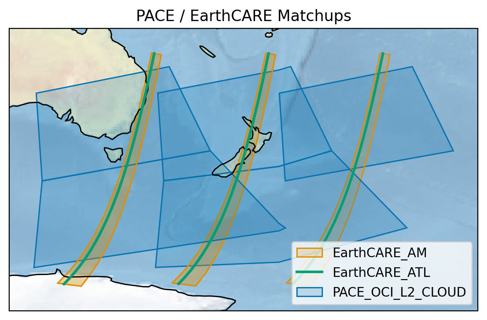

# pace-earthcare-matchups
Search, filter, download, and intercompare [PACE](https://pace.gsfc.nasa.gov/) and [EarthCARE](https://earth.esa.int/eogateway/missions/earthcare) data, all with a few lines of Python. This repository contains utilities to simplify all stages of PACE / EarthCARE intercomparisons and improve reproducibility.

Here is a simple example, which searches for all PACE OCI L2 Cloud granules on a specific day, and finds the overlaps with two EarthCARE products. The filtering uses metadata to avoid unnecessary downloads. Only matching files are downloaded, and masks between matching products are computed and stored for later. The last step is to plot the results!

```
maap = MAAP()  # NASA MAAP client
client_esa = Client.open(ESA_CATALOGUE)  # ESA STAC client
matchups = get_matchups(
    maap=maap,
    client_esa=client_esa,
    long_term_token=_ESA_MAAP_TOKEN,
    shortname_pace="PACE_OCI_L2_CLOUD",
    shortnames_earthcare=["ATL_CTH_2A", "AM__CTH_2B"],
    temporal=(TIME_START, TIME_END),
    bbox=BBOX,
    limit=5,
)
plot_matchups(matchups)
```



Find the full code for this example [here](notebooks/tutorial.md).

## Setup

### Dependencies

You will need to separately install [maap-py](https://github.com/MAAP-Project/maap-py).


### Install

First, clone this repository, and navigate to its directory:
```
git clone https://github.com/seanremy/pace-earthcare-matchups/
cd pace-earthcare-matchups
```

Then, installation is simple:
```
pip install .     # regular install
pip install -e .  # editable install
```

### Data directory

Either create a directory or symbolic link called `data`. All PACE and EarthCARE files will be downloaded to standard paths under this directory, so make sure you have enough storage space before you try and download dozens of matchups.

### ESA MAAP token

To download EarthCARE data, you will need to get an ESA MAAP token. Go to [the ESA MAAP portal](https://portal.maap.eo.esa.int/ini/services/auth/token/), and under `Data Access` click `Generate Data Access Token`. It will prompt you to sign in. Once you have a token, save it as a new file called `token.txt`.


## What next?
This repository is very new, and still under construction. Some features to look forward to:
- support for all PACE and EarthCARE L1B - L2 products
- standard interpolation options to simplify working with two different grids
- a suite of notebooks showcasing some exciting PACE / EarthCARE synergies

## Contributing
Contributions to `pace-earthcare-matchups` are highly encouraged and greatly appreciated! Come back soon for guidelines on how to contribute. Until then, feel free to raise an issue or suggest a feature.