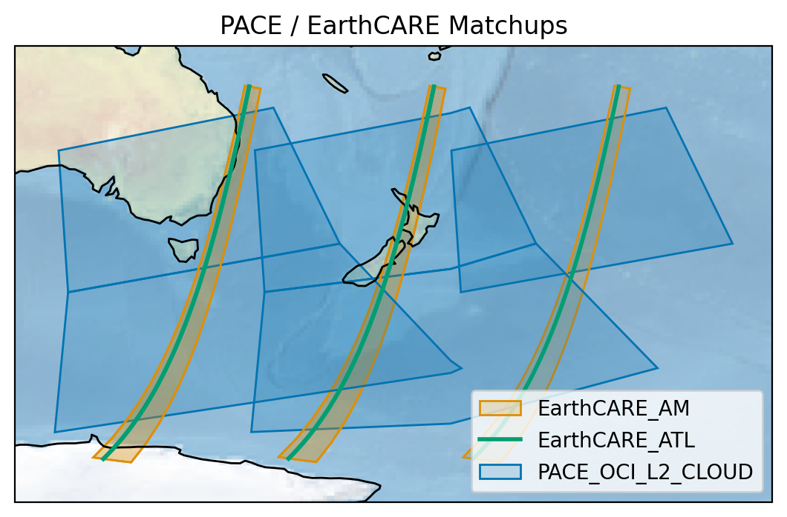

# pace-earthcare-matchups (PEM)
Search, filter, download, and intercompare [PACE](https://pace.gsfc.nasa.gov/) and [EarthCARE](https://earth.esa.int/eogateway/missions/earthcare) data, all with a few lines of Python. With a variety of utilities, pace-earthcare-matchups (PEM) simplifies all stages of PACE / EarthCARE intercomparisons, deduplicating coding effort and improving reproducibility.

Here is a simple example, which searches for all PACE OCI L2 Cloud granules on a specific day, and finds the overlaps with two EarthCARE products. The filtering uses metadata to avoid unnecessary downloads. Only matching files are downloaded, and masks between matching products are computed and stored for later. The last step is to plot the results!

```
matchups = get_matchups(
    shortname_pace="PACE_OCI_L2_CLOUD",
    shortnames_earthcare=["ATL_CTH_2A", "AM__CTH_2B"],
    temporal=(TIME_START, TIME_END),
    bbox=BBOX,
    limit=5,
)
plot_matchups(matchups)
```



Find the full code for this example [here](notebooks/tutorial.md).

## Setup

### Dependencies

You will need to separately install [maap-py](https://github.com/MAAP-Project/maap-py).


### Install

First, clone PEM, and navigate to its directory:
```
git clone https://github.com/seanremy/pace-earthcare-matchups/
cd pace-earthcare-matchups
```

Then, installation is simple:
```
pip install .     # regular install, OR ...
pip install -e .  # editable install
```

### Data directory

There are two options for telling `pace-earthcare-matchups` where to store data. Option 1: create a directory or symbolic link called `data` under the root directory of the repo. Option 2: set the environment variable `PACE_EARTHCARE_DATA_PATH` to the desired location.

All PACE and EarthCARE files will be downloaded to standard paths under this directory, so make sure you have enough storage space before you try and download dozens of matchups. Level 1 files in particular can be quite large.

### Access NASA Data

NASA data is available through the CMR. This repository offers two different options for how to interface with the CMR:
1. `maap-py`: You may use this option if you are working on the NASA MAAP or if you are working from a NASA computer.
2. `earthaccess`: Otherwise, use earthaccess. You will need a (free) [Earthdata account](https://urs.earthdata.nasa.gov/). To avoid having to manually enter your credentials every time, use one of the alternate options described in the [earthaccess docs](https://earthaccess.readthedocs.io/en/stable/user_guide/authenticate/), such as `.netrc`.

`pace_earthcare_matchups` uses `maap-py` by default. To use `earthaccess` instead, set the following environment variable:
```
set PACE_EARTHCARE_MATCHUPS_USE_EARTHACCESS=1
```

### ESA MAAP token

To download EarthCARE data, you will need to get an ESA MAAP token. Go to [the ESA MAAP portal](https://portal.maap.eo.esa.int/ini/services/auth/token/), and under `Data Access` click `Generate Data Access Token`. It will prompt you to sign in. Once you have a token, save it as a new text file. Then, set the environment variable `ESA_MAAP_TOKEN_PATH` to the path where you saved your token.
```
set ESA_MAAP_TOKEN_PATH="/path/to/your/token/file.txt"
```

### Notebooks

Notebooks in PEM are saved as [MyST markdown](https://mystmd.org/). You can convert between Myst and Jupyter notebooks easily, for example:
```
jupytext --to notebook notebooks/tutorial.md
```


## What next?
This repository is very new, and still under construction. Some features to look forward to:
- standard interpolation options to simplify working with two different grids
- a suite of notebooks showcasing some exciting PACE / EarthCARE synergies

## Contributing
Contributions to `pace-earthcare-matchups` are highly encouraged and greatly appreciated! Come back soon for guidelines on how to contribute. Until then, feel free to raise an issue or suggest a feature.